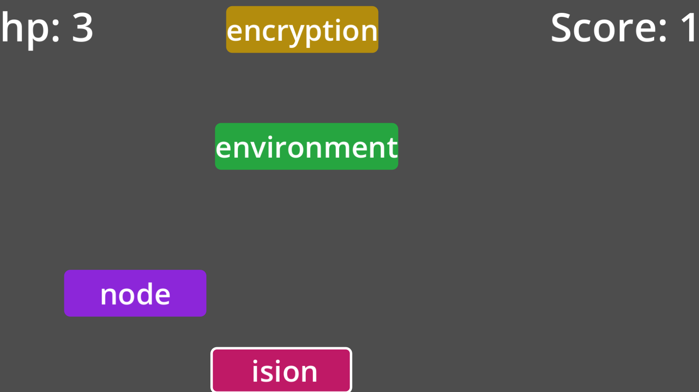

# 🎮 Godot 打字（Godot Typing）
一个使用 Godot 4 开发的，简单的打字练习工具

> 单词会不断从上往下掉落，玩家需要快速、准确地输入对应单词，  
> 在节奏与压力中训练 **反应力、键位熟练度和打字准确性**。
> ✨ 有着良好的视觉效果和提示音效

## 🕹️ 玩法说明

- 单词会 **持续从屏幕上方下落**
- 使用键盘输入对应单词
- ✅ 输入正确：  
  - 单词逐字消失  
  - 得分 +1  
  - 播放正反馈音效
- ❌ 输入错误 / 单词掉出屏幕：  
  - 扣除生命值（HP）
- 💀 HP 归零后游戏结束

🧑‍🏫 在线体验链接（Github Page）
🔗 **GitHub Pages**：  https://huluntuntao.github.io/godot_typing/

本地可执行文件（Linux、Windows、macOS、Web-WASM）：https://github.com/HuLunTunTao/godot_typing/releases

**截图**

